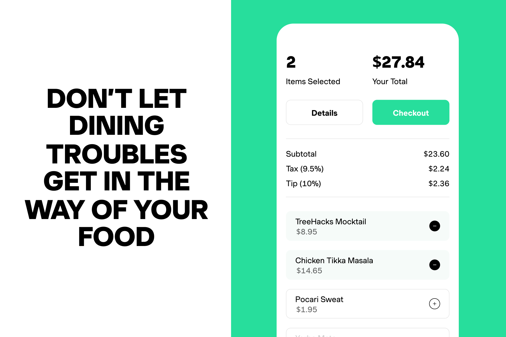

# MealMingle

MealMingle was created during Stanford's TreeHacks 2023 with a 36-hour constraint. Contributors: Dhruv Chowdhary, Hanson Leung, Winson Cheng, and Alfred Yu.
## Inspiration
It was our first time attending a hackathon, and we were filled with equal parts excitement and trepidation as we made our way to Stanford's TreeHacks. Having come from Berkeley, USC, and right here at Stanford without teams, we all met in Huang basement. We soon settled into the opening ceremonies and listened to the speakers like Sajith from Benchling and sponsors whose products made our jaws drop: we knew that TreeHacks was the right place for us. 

Over the next few hours, we spent time brainstorming ideas and trying to come up with something that would be both impactful and feasible given our varied backgrounds. We had CS students, designers, and businesspeople on our team, but we were all new to the world of hackathons and unsure of where to begin.

We spent hours ideating, jotting down countless ideas on a napkin (yes, we really did). But no matter what we came up with, we always seemed to hit a wall when it came to actually building the product. We attended lectures and workshops, trying to pick up as much technical knowledge as we could, and reached out to mentors for guidance.

Our final idea was inspired by Otsuka Valuenex which made us realize how undervalued food is as a medium of social connection. We wanted to create a webapp that would streamline this process for a better experience. We chose to tackle both challenges of food finding and receipt splitting into a single concise application.

## What it does
The goal of MealMingle is to streamline the entire eating experience. We believe the ability for restaurants to connect people through the joy of sharing good food is highly underestimated, which is why we’ve developed a software which does all the hard work for the foodies out there who don’t want to waste time scrolling pages of Yelp for restaurants or doing frustrating bill calculations. 

Using receipt scanning OCR, MealMingle allows friends and family to easily split the bill based on what items they ordered. All you have to do is open the MealMingle website then scan the receipt, and a QR code gets generated for everyone to join and select which items they bought. Once confirmed, payment requests get sent out to everyone through Checkbook! This consolidated process ensured that each person paid only for the items they ordered, while minimizing the potential for errors and disagreements.

Using the GPT-3 model, MealMingle also solves the issue of finding a great place to eat. You simply input various parameters into our food finder and are returned with a list of personalized restaurants, tuned to your preferences.

Enjoy your night out with friends to the fullest – leave the tedious tasks to us.

## How we built it
We first used Figma to prototype our thoughts into designs. We then used Retool to create an interface that finds restaurant options based on user inputted parameters that were fed into GPT-3. We built our website using a mixture of HTML, CSS, and JavaScript for style and functionality. Finally, we added payment functionality using Checkbook.

## Challenges we ran into
Over the course of 36 hours, our team struggled through many unexpected challenges as we used various different APIs for the first time. While each challenge was frustrating in its own right, through many sleepless collaborative hours, we managed to conquer each one and not only grow stronger as developers, but also as teammates.

In building the Food Finder AI bot and reversing the cost-to-person dictionary, difficulty took the form of navigating the Retool platform and utilizing prompt engineering with Open AI’s API to create the desired outputs from GPT-3. At first, the Retool software was undoubtedly foreign for us: image generation was laggy, handling queries involved a steep learning curve, and prompts would consistently fail due to timeout errors from the Open AI API. However, with help from the engineers at Retool, we worked at understanding the software tirelessly until we optimized our features to our liking and were able to navigate the system like experts.

One of the most frustrating roadblocks we ran into in this segment of the project was GPT-3’s inability to distribute tax and tip among the restaurant party and properly calculate invoice amounts. Reversing the dictionary was a difficult task involving many steps, and we struggled with articulating to GPT-3 exactly what we wanted as the output. After tedious debugging and experimenting with different prompts, however, we finally engineered a prompt which caused GPT-3 to consistently understand our intentions; after overcoming that, the rest was history.

Website development proved to be much harder than expected. Formatting the HTML elements was a painstaking effort because we wanted everything to be perfect. Figuring out how to incorporate APIs into the website also proved to be difficult, especially given that many of us were not familiar with APIs prior. We tried to use Tesseract to scan receipts, but our programs were unable to successfully pull the data. In the end, we used the requests library and OCR which accomplished the same task.

## Accomplishments we’re proud of
Looking back on these past 36 hours and browsing through the software we’ve developed, we are extremely proud of ourselves for what we have for all being novice hackers. While forming our team, we definitely had doubts regarding how we were going to perform: none of us have extensive programming experience, nor did any of us have a strong idea of what we wanted to create heading into the hackathon. However, looking at how smoothly our software runs and how successfully we incorporated GPT-3 to do the heavy-lifting in our program, we’re all more than satisfied with how far we’ve come since Friday night.

Three feats we’re especially proud of include our utilization of various APIs into our program, our extensive front-end web development, and our leveraging of AI techniques such as computer vision and natural language processing. Despite our lack of hackathon experience, all of us embraced the unknown and created a project utilizing APIs from Checkbook, Retool, and Open AI. The benefits these APIs provided allowed us to create an impressive project we could’ve never constructed from scratch. We also dived headfirst into front-end development despite our team’s extremely limited prior experience with HTML and CSS, though granted we had GitHub Copilot to aid us in our endeavors. Lastly, we’re proud we had the ambition to tackle high-level topics like computer vision and NLP and weren’t discouraged from building projects which excited us. The encouraging learning environment of TreeHacks helped us accomplish feats we never would’ve dreamed of finishing in our wildest dreams, and all of us are beyond excited to continue gaining hackathon experience and pushing ourselves beyond our utmost limits.

## What we learned
In the end, we were proud of what we had accomplished, and even more proud of the teamwork and collaboration that had gone into creating it. We learned frontend, backend, API calls and how to use products such as Retool and Checkbook. We may have been new to the world of hackathons, but we had proven that with hard work and determination, anything was possible. We hope to attend more hackathons in the future and to be here for Treehacks again next year!

## What's next for MealMingle
A lot! Most importantly, we want to make our Food Finder functionality available on other devices so that others can get personalized restaurant recommendations. We’re also heavily interested in utilizing more APIs and AI technologies to further improve different facets of the culinary experience. A significant goal of ours that we were unable to implement due to the time constraints was to have the Food Finder chatbot be more conversational and leverage user data and machine learning to make personalized restaurant recommendations. With more time and resources, we look forward to transforming features like these from ideas into realities and fleshing out MealMingle to be an efficient and convenient software for everyone!
